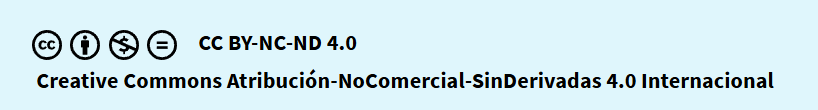

# ControlVersionesGit
## 1.-Índice
## [2.-Sistemas de control de versiones: Git](git.md)
## [3.-Lenguajes de marcas: Markdown](markdown.md)
## 4.-Repositorio: Github
## [5.-Conceptos básicos Git/Github](github.md)
## [.-Referencias:](referencias.md)
## [.-Autores:](autores.md)

### Licencia Creative Commons

