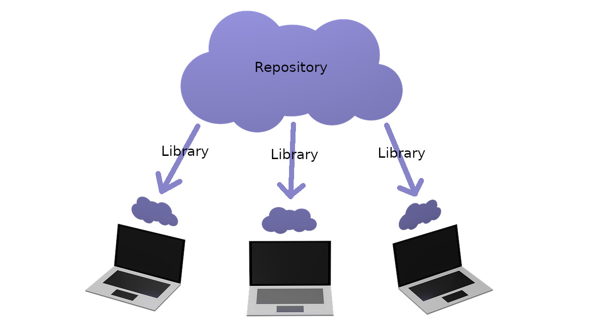
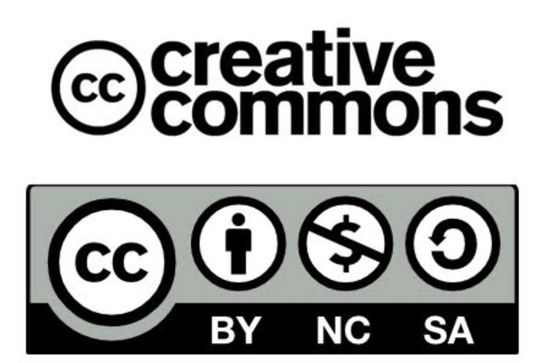

 # Repositorio: Github 
 ## ¿Qué es GitHub?

GitHub es una plataforma en la nube que permite almacenar proyectos de software y gestionarlos usando Git (un sistema de control de versiones).
En otras palabras, es como una “nube para programadores” donde puedes guardar tu código, compartirlo, colaborar con otros y llevar un historial de cambios.

## ¿Qué es un repositorio?

Un repositorio (o repo) en GitHub es un espacio donde guardas tu proyecto.

Piensa en el repositorio como una carpeta especial que además guarda el historial de todo lo que pasó en su interior.

## Contenido típico de un repositorio

Dentro de un repo de GitHub vas a encontrar cosas como:

Código fuente (archivos .py, .js, .html, etc.)

**README.md** → archivo que explica de qué trata el proyecto.

**.gitignore** → archivo que dice qué no guardar en el historial.

**Licencia**→ para indicar los permisos de uso del proyecto.

**Historial de commits** → cada cambio que se hizo en el proyecto.

## Ventajas de usar un repositorio

**Historial de cambios** → puedes ver quién hizo qué y cuándo.

**Colaboración**→ varios programadores pueden trabajar juntos.

**Seguridad** → tu código está respaldado en la nube.

**Control de versiones** → puedes volver a un estado anterior si algo se rompe.

**Open Source** → puedes publicar proyectos para que cualquiera los use y mejore.

